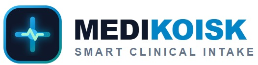
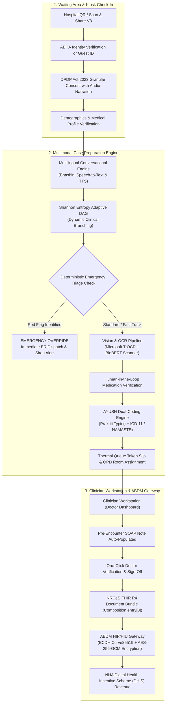

<div align="center">
  

  # MEDIKOISK
  ### Autonomous AI-Driven Adaptive Patient Case-Taking Kiosk

  [](https://abdm.gov.in)
  [](https://nrces.in)
  [](https://www.meity.gov.in)
  [](https://bhashini.gov.in)
  [](https://namstp.ayush.gov.in)
  [](LICENSE)

  <p align="center">
    <strong>Autonomous outpatient triage, multimodal vernacular case preparation, and automated NRCeS FHIR R4 clinical note generation for high-density hospital OPDs.</strong>
  </p>
</div>

---

## Executive Overview & Problem Statement

In Indian public and tertiary healthcare institutions (AIIMS, State Medical Colleges, District Hospitals), an outpatient department (OPD) physician frequently attends to **80–120 patients per session**, leaving an average of **2 to 3 minutes per consultation**. Over **60% of this critical encounter time is squandered on clerical transcription**, deciphering illegible handwritten historical prescriptions, repeating standard systemic reviews across language barriers, and manually entering patient demographics into fragmented Electronic Health Record (EHR) databases.

### Core Critical Bottlenecks Addressed:
1. **Physician Burnout & Clerical Burden**: Doctors spend valuable clinical cognitive capacity on mechanical documentation rather than diagnostic acumen and patient empathy.
2. **Language & Literacy Barriers**: Rural and semi-urban patients cannot articulate complex symptoms or read formal English/Hindi clinical questionnaires.
3. **Dangerous Triage Delays**: Acute emergencies (unstable angina, acute abdomen, anaphylaxis, stroke symptoms) sit unnoticed in standard OPD queues instead of triggering deterministic emergency resuscitation overrides.
4. **Prescription Deciphering Failure**: 40%+ of historical paper prescriptions are illegible, leading to adverse drug-drug interactions, missed medication reconciliations, and repeated diagnostic testing.
5. **Lack of Dual-System Interoperability**: Traditional AYUSH healthcare (Ayurveda, Yoga & Naturopathy, Unani, Siddha, Homeopathy) operates in silos without unified mapping to WHO ICD-11 modern medicine ontologies.

**MEDIKOISK solves this end-to-end.** Installed as a dedicated touch-and-voice kiosk or accessed via mobile Scan & Share in the hospital waiting hall, MEDIKOISK interviews the patient in their native tongue, runs an entropy-minimizing adaptive diagnostic decision tree, digitizes past prescriptions with TrOCR + BioBERT, checks for statutory DPDP consent, maps conditions to dual ICD-11/NAMASTE codes, and delivers a complete, verified **NRCeS FHIR R4 SOAP Clinical Summary** to the doctor's workstation before the patient enters the examination room.

---

## Architectural Highlights & System Flow



---

## 9-Step Clinical Intake Pipeline

| Step | Module | Clinical & Technical Description |
|:---:|:---|:---|
| **01** | **Hospital QR Check-In** | Patient scans the hospital's ABDM Scan & Share V3 QR code or inputs ABHA address/number (`rohan.kulkarni@abdm`). Full demographic pre-fill via mock ABDM Gateway with instant Guest Registration fallback. |
| **02** | **DPDP Informed Consent** | Statutory notice under Section 6 of the Digital Personal Data Protection Act 2023. Explicit purpose limitation, non-coercive withdrawal rights, and vernacular voice read-aloud in 6 Indic languages. |
| **03** | **Demographics & Profile** | Verification of age, biological sex, primary language, emergency contact provenance, known allergies, and chronic medical history. |
| **04** | **Shannon Entropy Adaptive Intake** | Dynamic diagnostic questionnaire that optimizes information gain per question ($H(X)$ entropy reduction). Supports real-time speech input with Bhashini IndicConformer and instant vernacular transcription. |
| **05** | **Prescription & Document OCR** | Multimodal ingestion of historical paper prescriptions and discharge summaries. Uses simulated Microsoft TrOCR + BioBERT pipeline with confidence scores and bounding box visualizers. |
| **06** | **Human-in-the-Loop Verification** | Patient verifies OCR-extracted medications (e.g., *Pantoprazole 40mg*, *Paracetamol 650mg*), dosages, frequencies, and allergy cross-checks to eliminate AI hallucinations before clinical review. |
| **07** | **AYUSH & Integrative Intake** | Constitutional Prakriti assessment (Vata, Pitta, Kapha) and dual-coding mapping chief complaints simultaneously to WHO ICD-11 MMS, AYUSH NAMASTE, and WHO ICD-11 TM2 (Traditional Medicine). |
| **08** | **Thermal Queue Token Slip** | Instant OPD queue token generation with deterministic department routing (Room 104 - Gastroenterology), live estimated wait time (8.4 mins), and printable thermal slip. |
| **09** | **Clinician Workstation Sign-Off** | Physician reviews pre-generated SOAP summary (Subjective, Objective, Assessment, Plan), checks emergency red flags, verifies provenance tags, and clicks "Verify & Sign Encounter" to publish FHIR R4 bundle. |

---

## Key Platform Features

### 1. Clinician Workstation (Doctor Dashboard)
- **Zero-Clerical Overhead**: Complete SOAP notes auto-synthesized prior to patient consultation.
- **Red-Flag Telemetry Alert**: Visual callouts for deterministic red flags (e.g., radiating substernal chest pressure, hematemesis, peritoneal signs).
- **Dual-Coding Ontology Viewer**: Side-by-side display of ICD-11 modern codes (e.g., `MD81.0` Epigastric Pain) alongside NAMASTE codes (`AAM-04` Amlapitta) and ICD-11 TM2 codes.
- **Provenance & Confidence Tracking**: Every clinical datum is tagged with its source (`PATIENT_VOICE`, `TROCR_VISION`, `AYUSH_SELF_REPORT`, `ABDM_LONGITUDINAL`) and confidence percentage.
- **NRCeS FHIR R4 Bundle Export**: Instant generation and download of complete, valid FHIR Document Bundles conformant to Indian National Release Center for Electronic Health Standards.

### 2. Hospital Administration & Emergency Triage Desk
- **8 Real-Time Operational KPIs**: OPD Visits Today, Digital Adoption Rate, Live Waiting Count, Emergency Triggers, TrOCR Documents Processed, ABHA vs. Guest ratio, Bhashini Vernacular adoption, and DHIS Revenue Earned.
- **Deterministic Emergency Flash Feed**: Instant acoustic and visual alert system for critical triage overrides with one-click nurse dispatch and acknowledgement.
- **Synchronous OPD Queue Manager**: Live search, priority filtering (`EMERGENCY`, `FAST_TRACK`, `STANDARD`), and room-allocation tracker.
- **Digital Health Incentive Scheme (DHIS) Telemetry**: Automatic calculation of hospital earnings under NHA Corrigendum 7 (₹5 per qualifying OPD consultation, ₹10 per consent exchange).

### 3. Patient Privacy Center & Clinical Governance
- **DPDP Act 2023 Section 6, 11 & 12 Implementation**:
  - **Revoke Consent**: One-click immediate decoupling of patient data from hospital middleware.
  - **Export Health Data**: Full portable download of machine-readable JSON health records and audit traces.
  - **Right to Erasure**: Statutory request submission under Section 12 with automatic session cache purge.
- **ABDM Fidelius v1.2 Cryptographic Suite**:
  - **Key Agreement**: ECDH over Curve25519 for ephemeral shared secrets.
  - **Symmetric Encryption**: AES-256-GCM with HKDF-SHA256 key derivation.
  - **Payload Integrity**: SHA-256 digest hash preventing transmission tampering.
- **Immutable Cryptographic Audit Trail**: Filterable and searchable event log capturing every consent grant, triage override, OCR scan, and FHIR export with microsecond timestamps.

### 4. Mobile-First & Responsive UX System
- **Thumb-Accessible Mobile Bottom App Bar**: Fixed native navigation bar on small devices (`md:hidden`) with active tactile indicators, safe-area clearance (`pb-24`), and live emergency badge counters.
- **Mobile Step Progress Header**: Dedicated compact step tracker (Steps 1–9) with breadcrumbs, progress bar, back navigation, and instant restart.
- **Touch Targets & Typography**: 44px+ minimum touch targets, 16px font inputs to prevent iOS Safari auto-zoom, and responsive layout collapsing without horizontal page scroll.
- **Accessible Multi-Theme Engine**: Seamless switching between AIIMS Clinical Light and Linear High-Contrast Dark modes with 4 accent color palettes (Clinical Emerald, Glacier Cyan, Linear Indigo, Precision Jade).

### 5. Full Multilingual Localization (6 Indic Languages)
- **Zero-Barrier Vernacular Ingestion**: Seamless, real-time UI translation across **English (`en`)**, **Hindi (`hi` — हिन्दी)**, **Marathi (`mr` — मराठी)**, **Tamil (`ta` — தமிழ்)**, **Bengali (`bn` — বাংলা)**, and **Telugu (`te` — తెలుగు)**.
- **Comprehensive Viewport Coverage**: Changing the language instantly translates:
  - **Landing Page**: Problem/Solution bottleneck breakdown, architectural differentiation bento, impact triad metrics, and national feasibility models.
  - **Patient Kiosk**: Informed consent notices, demographic profiles, native chief complaint cards, adaptive DAG questions, option selections, and safety red-flag indicators.
  - **Clinician Workstation**: SOAP summary tabs, subjective narrative, objective vitals, diagnostic assessment clues, and digital sign-off actions.
  - **Admin Triage Desk**: Real-time operational KPIs, deterministic emergency triage override alert banners, live OPD queue distribution, and room allocation tables.
  - **Privacy Center**: DPDP statutory rights (revocation, portability export, right to erasure), ABDM Fidelius cryptographic specifications, and immutable clinical audit trails.
- **Project Bhashini Integration**: Multi-dialect automatic speech recognition (ASR) and text-to-speech (TTS) audio guidance powered by IndicConformer phonetic modeling.

---

## National Regulatory & Standards Compliance

| Regulatory Framework | Authority | Implementation in MEDIKOISK |
|:---|:---|:---|
| **ABDM Milestone 1 (M1)** | National Health Authority (NHA) | ABHA Number creation, ABHA Address resolution, Scan & Share V3 QR ingestion. |
| **ABDM Milestone 2 (M2)** | National Health Authority (NHA) | Health Information Provider (HIP) care context linking and NRCeS FHIR R4 publishing. |
| **ABDM Milestone 3 (M3)** | National Health Authority (NHA) | Health Information User (HIU) consent manager handshake and longitudinal record retrieval. |
| **ABDM Milestone 4 (M4)** | National Health Authority (NHA) | National Health Claims Exchange (NHCX) pre-authorization data structure readiness. |
| **FHIR R4 NRCeS Profile** | MoHFW / NRCeS India | Full FHIR R4 Document Bundle with `Composition` as strict `entry[0]`, linked `Patient`, `Encounter`, `Condition`, `Observation`, and `MedicationStatement` resources. |
| **DPDP Act 2023** | Ministry of Electronics & IT (MeitY) | Granular notice, explicit consent, non-coercive withdrawal, statutory erasure, and immutable audit trails. |
| **Fidelius Encryption v1.2** | NHA Technical Specifications | Zero cleartext health data; Curve25519 ECDH + AES-256-GCM end-to-end encryption. |
| **AYUSH NAMASTE & ICD-11 TM2** | Ministry of AYUSH & WHO | National AYUSH Morbidity & Standardized Terminology Electronic Portal codes dual-mapped with WHO Traditional Medicine Module 2. |

---

## Technology Stack

- **Core Framework**: React 18.3 + TypeScript 5.6
- **Build Tool & Dev Server**: Vite 5.4 (ultra-fast HMR and optimized tree-shaking)
- **Styling Architecture**: Vanilla Tailwind CSS 3.4 (custom design system tokens, Linear Dark Theme, zero external bloated CSS frameworks)
- **Icons & Visual Language**: Lucide React
- **Confetti & Delight**: Canvas-Confetti (milestone and sign-off celebrations)
- **Testing & E2E Validation**: Playwright 1.63
- **Knowledge Graph**: Graphify AST persistent codebase architecture graph (`graphify-out/`)

---

## Demo Personas & Test Scenarios

The platform includes built-in realistic clinical personas to test various healthcare scenarios:

1. **Rohan Kulkarni (`PAT-001`)**
   - **Profile**: 42-year-old male, ABHA: `91-8842-1209-7731`, English speaker.
   - **Clinical Presentation**: Epigastric burning pain radiating to retrosternal area for 3 weeks; aggravated by spicy food.
   - **Pipeline Path**: Scan & Share check-in $\rightarrow$ Adaptive Gastrointestinal DAG $\rightarrow$ TrOCR prescription scan (Omeprazole 20mg) $\rightarrow$ Fast Track OPD routing $\rightarrow$ Dr. Shukla Gastroenterology review.
2. **Sunita Deshmukh (`PAT-002`)**
   - **Profile**: 38-year-old female, ABHA: `91-3392-8812-4040`, Marathi native speaker.
   - **Clinical Presentation**: Recurrent hyperacidity and post-prandial heaviness with past peptic ulcer history.
   - **Pipeline Path**: Marathi Bhashini vernacular voice intake $\rightarrow$ Dual AYUSH assessment (Prakriti: Pitta-Vata) $\rightarrow$ Dual-coded as ICD-11 `MD81.0` + NAMASTE `AAM-04` (Amlapitta).
3. **Ramesh Verma (`PAT-003`)**
   - **Profile**: 56-year-old male, ABHA: `91-4821-9920-3314`, Hindi native speaker.
   - **Clinical Presentation**: Type 2 Diabetes Mellitus, Essential Hypertension on Metformin & Telmisartan.
   - **Pipeline Path**: Multi-medication OCR verification with cross-reactivity and allergy checking.
4. **Emergency Deterministic Triage Override**
   - **Test Trigger**: Select "Chest Pain" complaint or enter severe substernal crushing pain radiating to left shoulder/jaw with diaphoresis.
   - **Platform Response**: Adaptive intake halts immediately; system fires deterministic Red Flag Emergency alert, sounds acoustic siren, dispatches resuscitation nurse, overrides OPD queue, and assigns Priority 1 Emergency room.

---

## Monorepo Architecture & Local Development

This repository is organized as a unified monorepo containing both the user-facing web kiosk application and backend API services.

### Repository Layout

```
MEDIKOISK_prototype/
├── frontend/                     # Patient Kiosk & Clinician Web Application (React + Vite)
│   ├── public/                   # Static public assets (medikoisk-logo.png)
│   ├── src/                      # Application source code
│   │   ├── components/           # UI components (Patient, Doctor, Admin, Common)
│   │   ├── context/              # Global state, theme, language, and clinical store
│   │   ├── data/                 # Diagnostic DAGs, Ayush ontology, and dictionaries
│   │   ├── services/             # ABDM, FHIR, TrOCR, Queue, and Voice services
│   │   └── types/                # Strongly-typed clinical definitions
│   ├── package.json              # Frontend dependencies and Vite configuration
│   ├── tailwind.config.js        # Design system tokens and styling rules
│   ├── tsconfig.json             # TypeScript compiler settings
│   └── vite.config.ts            # Vite bundler configuration
├── backend/                      # Server-side API & Gateway Services
│   ├── src/                      # API controllers, routes, models, and connectors
│   └── README.md                 # Backend onboarding, Node.js & Python starter templates
├── package.json                  # Monorepo workspaces configuration & delegation scripts
└── README.md                     # Comprehensive project documentation
```

---

### Prerequisites
- **Node.js**: `v18.0.0` or higher
- **npm**: `v9.0.0` or higher

### Quickstart Setup

You can run the application directly from the root using npm workspace delegation scripts, or by navigating into the `frontend/` directory.

#### Method 1: From Repository Root (Recommended)

```bash
# 1. Clone the repository
git clone https://github.com/ekansh123123-debug/MEDIKOISK_prototype.git
cd MEDIKOISK_prototype

# 2. Install frontend dependencies
npm --prefix frontend install

# 3. Start frontend dev server
npm run dev
# Or explicitly:
npm run dev:frontend
```

The application will launch on `http://localhost:5173`.

#### Method 2: Inside `frontend/`

```bash
cd frontend
npm install
npm run dev
```

---

### Monorepo Scripts Reference

| Command | Working Directory | Description |
|:---|:---:|:---|
| `npm run dev` / `npm run dev:frontend` | Root | Starts the Vite development server for `frontend/` |
| `npm run dev:backend` | Root | Starts the backend development server (once backend is configured) |
| `npm run build` / `npm run build:frontend` | Root | Runs TypeScript check (`tsc`) and generates production bundle in `frontend/dist` |
| `npm run preview` | Root | Previews the production build locally on Vite preview server |

---

### Vercel Deployment Guide

Since this repository is a monorepo with `frontend/` and `backend/`:

1. In your **Vercel Dashboard**, go to your project **Settings** &rarr; **General**.
2. Locate the **Root Directory** setting and set it to:
   ```
   frontend
   ```
3. Vercel will automatically detect Vite, install dependencies from `frontend/package.json`, and deploy the build from `frontend/dist`.

---

### Keyboard Shortcuts & Accessibility
- `Ctrl + ,` or `Cmd + ,`: Open Platform Settings & Preferences modal
- `ESC`: Dismiss open modal dialogs / drawers
- `Tab` / `Shift + Tab`: Full accessible keyboard navigation through all form elements, steps, and dashboards.

---

## License

This prototype is developed under the **MIT License**. Compliant with Open Health Services (OHS) standards and National Health Authority guidelines.
